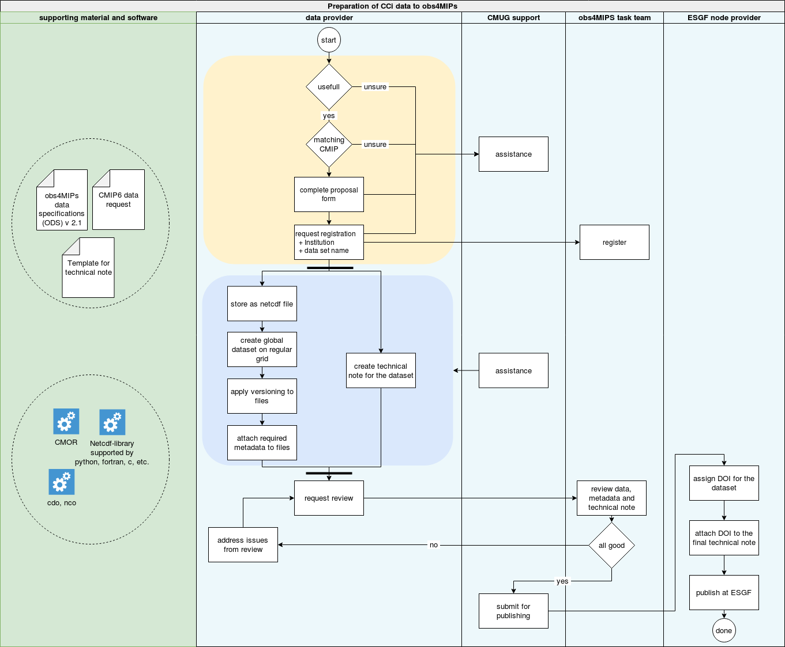

=====
About
=====

This documentation was created within the ESA-CCI+ CMUG project to support scientist that want to contribute their observational data to obs4MIPs. Obs4MIPs is a successful endeavor to facilitate the process of Earth system model evaluation by offering a set of relevant observations in a standardized form. Along with the data itself metadata and documentation needed to scientifically interpret and use the data is provided as well.

In the following diagram the overall process of data preparation is described. 

   Schematic description of the preparation process of obs4MIPs data.

This documentation covers all individual steps in this diagram in detail in the following sections. 

The important thing to note at this point is that there are four player involved in this process. First of all the **data provider** that needs perform the actual work of preparing his or her data. Always when assistance is needed in this process, be it questions that this documentation did not manage to answer or support with software issues, the data provider is encouraged to contact the **CMUG support**. In the later stages of this process the data files and the documentation will be handed over to the **obs4MIPs administration** that will make a review and provide feedback. For the final step of publishing the prepared data files and documents will be given to an **ESGF node provider**.

Fortunately, a number of existing resources such as software, online services and documentation are available to further assist the data providing scientists in this process. Those external resources are linked in the documentation and referred to whenever they might be useful in the preparation process. 

This documentation will be updated regulary during the ESA-CCI+ CMUG project and mature during the process of supporting the data providing scientists.  

